========================================
Setting up your development environment.
========================================

***********************************
Installing machine and other tools.
***********************************

--------------------------------------------
con_a0054:Virtual Machines Using Virtual Box
--------------------------------------------

'''''''''''
Description
'''''''''''

Virtual Machines
================

* A virtual machine (VM) is a "completely isolated guest operating system installation within a normal host operating system"
* Modern virtual machines are implemented with either software emulation or hardware virtualization.

Virtual Box
-----------

* A tool for making Virtual Machines
* Other such tools: VMware, Qemu, KVM.
* Its free (as in free food) and free (as in freedom)
* Quite Stable with good features like 
    1. Saving the running state of the machine
    2. SMP Support
    3. Dynamically growing hard disk
    4. Snapshots of the machine
    5. Cloning of the machines

Advantages - Virtual Machines
-----------------------------

* Better control on the system like switching off/on, saving state etc.
* Snapshot Feature helps in preserving the original state of the machine.  You can revert to the original setup anytime.
* Dynamically Expanding Storage helps is using the underlying hardware in best possible way.
* Cloning helps in making multiple copies of a machine configuration.
* Multiple machines can use the same harddisk and share the common regions of the hard disk.
* Very good for testing and POC.
* For backing up your old system, for example you are moving to a new hardware. You can make a virtual machine of the old machine.

Installing VirtualBox on Windows
--------------------------------

*   Go to the site ``https://www.virtualbox.org/wiki/Downloads``.
*   Find the right downloadable for your Windows machine.
*   Download and install the installer.

Installing VirtualBox on your Linux Appliance
---------------------------------------------

*   Using your software installer tool install the package ``virtualbox``.
*   Example: Ubuntu - ``sudo apt-get install virtualbox``
*   Example: Fedora - ``sudo dnf install  virtualbox``

Setting up a machine
~~~~~~~~~~~~~~~~~~~~
* Click "New"
* Enter Machine Name, Guest Operating System and Flavor
* Enter the RAM Size
* Create a new hard-disk
* Select the type of HDD as VDI (Virtual Box Disk)
    * VMDK will make a disk format of type VMWare Disk 
* Make is dynamically expanding
* Select the size and location. Make size as 10 GB
* Confirm the windows
* Congiure the network card. Add a network interface - make it attached and mark it Bridged

Knowing all Options
~~~~~~~~~~~~~~~~~~~

* General
    * Various details like where is the machine kept etc.
* System
    * Motherboard - Boot Order and RAM Size
    * Processor - Number of CPUs and Execution Cap
* Display
    * Video Memory
    * Monitor Count
    * Remote Display
* Storage
    * Add Delete harddisks and DVDs
    * Mount CD/DVD
* Audio
    * Enable disable audio
    * Audio controller
* Network
    * Add/delete network interfaces with different modes
    * ``Not attached`` - VirtualBox reports to the guest that a network card is present, but that there is no connection -- as if no Ethernet cable was plugged into the card. This way it is possible to "pull" the virtual Ethernet cable and disrupt the connection, which can be useful to inform a guest operating system that no network connection is available and enforce a reconfiguration.
    * ``Network Address Translation (NAT)`` - Ideal for browsing the Web, download files and view e-mail inside the guest, this default mode should be sufficient for you.
    * ``Bridged networking`` -  for more advanced networking needs such as network simulations and running servers in a guest. When enabled, VirtualBox connects to one of your installed network cards and exchanges network packets directly, circumventing your host operating systems network stack.
    * ``Internal networking`` - This can be used to create a different kind of software-based network which is visible to selected virtual machines, but not to applications running on the host or to the outside world.
    * ``Host-only networking`` - This can be used to create a network containing the host and a set of virtual machines, without the need for the hosts physical network interface. Instead, a virtual network interface (similar to a loopback interface) is created on the host, providing connectivity among virtual machines and the host.
    * ``Generic networking`` - Rarely used modes share the same generic network interface, by allowing the user to select a driver which can be included with VirtualBox or be distributed in an extension pack.

    * Source: http://www.virtualbox.org/manual/ch06.html

    * Serial Port
        * Serial Ports attached to the machine
    * USB
        * USB devices attached to the machine
    * Shared Folders
        * For sharing files between Host and Guest

.. raw:: latex

    \clearpage

-------------------------------------------------
con_a1221:LinuxInstallation: Installing Fedora 24
-------------------------------------------------

'''''''''''
Description
'''''''''''

Install Fedora 24
-----------------

Download the image from the site  : http://archives.fedoraproject.org/pub/archive/fedora/linux/releases/24/Workstation/x86_64/iso/Fedora-Workstation-Live-x86_64-24-1.2.iso

Select 1st option to start fedora installation.

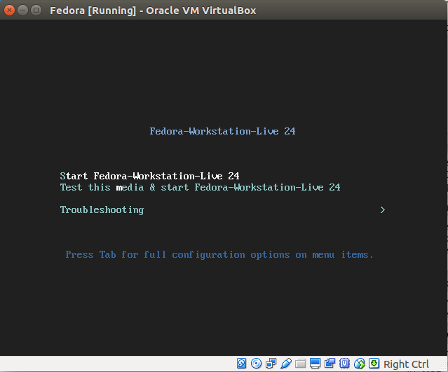

Select "install to hard drive"

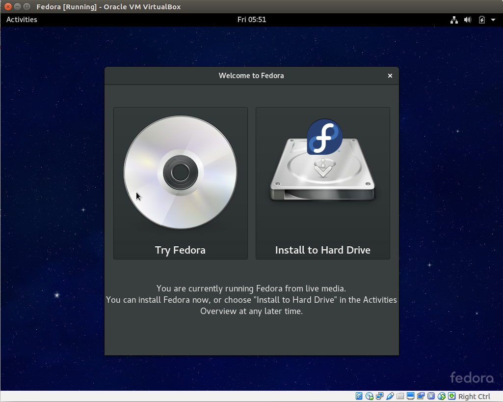

Select "English" as keyboard.

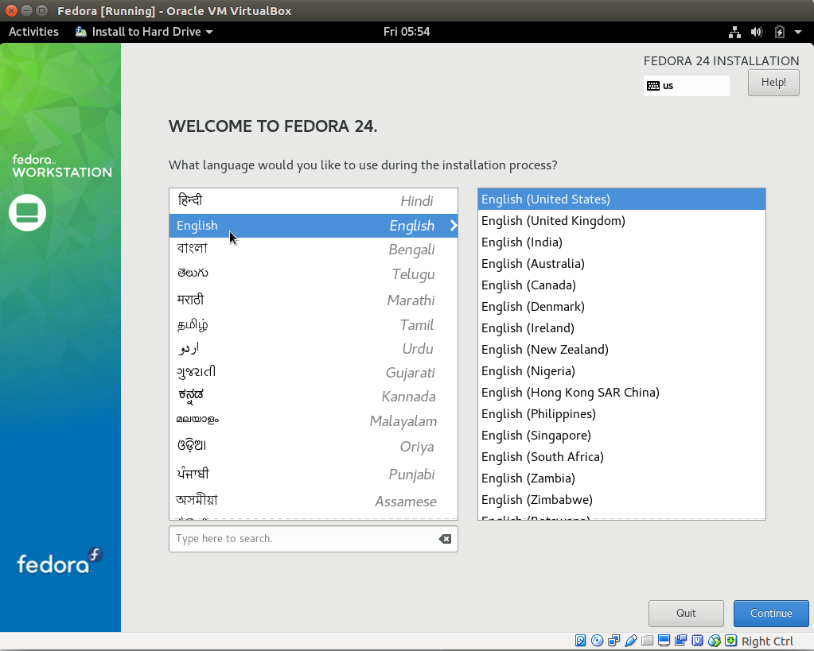

In the next Window click "INSTALLATION DESTINATION"

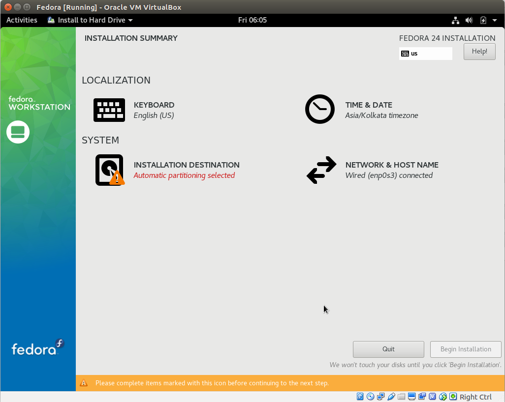

We do not want to make any changes. Just press done.

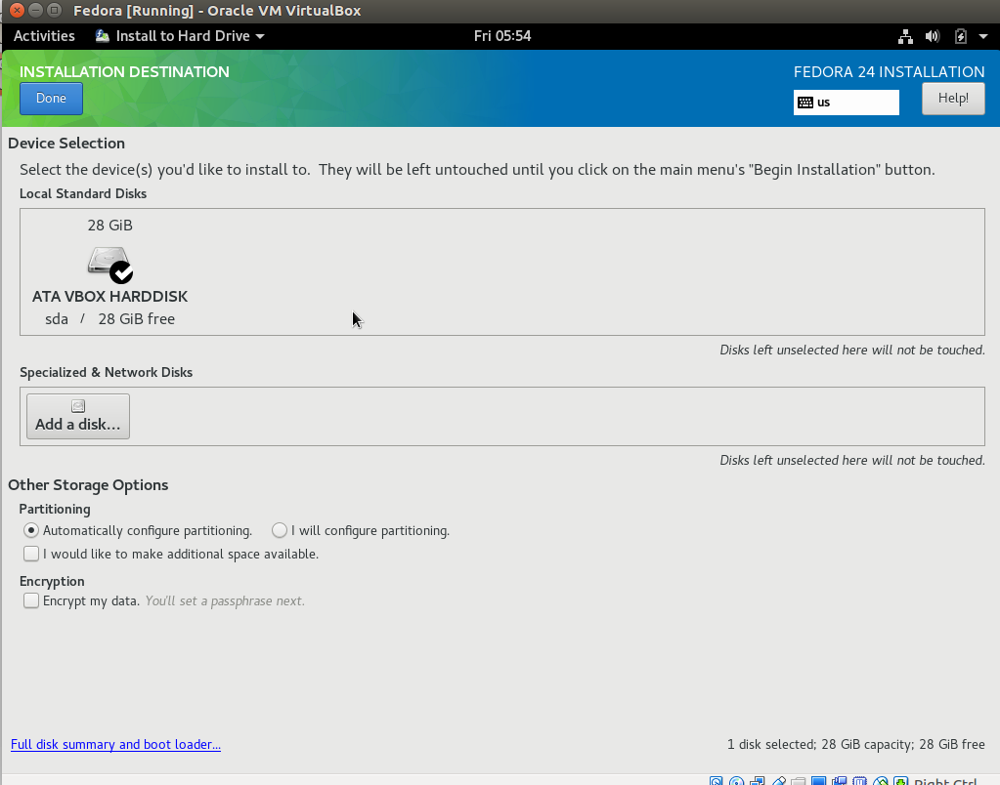

The storage configuration will be saved. It will start making the partitions.

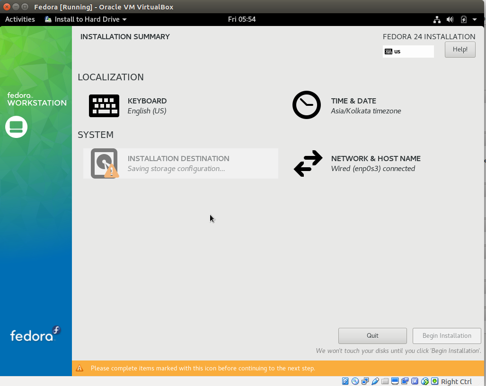

Here you need to enter the root password and a new user name and password. Press the relevant icons.

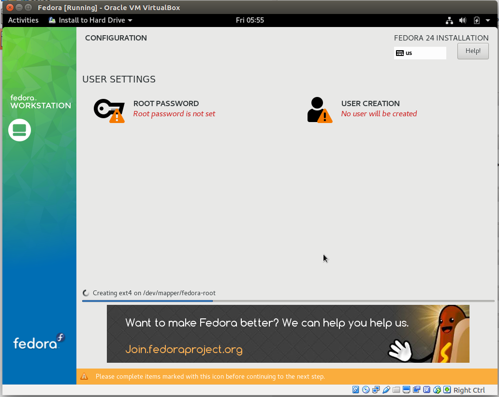

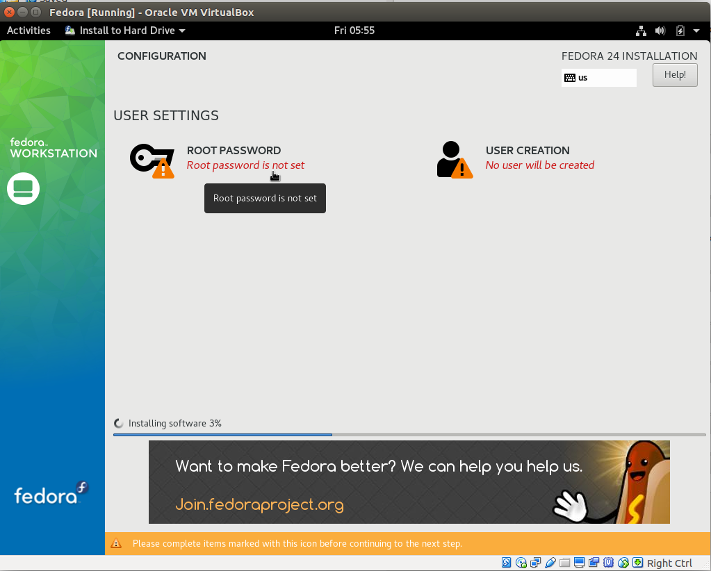

Enter the new password for the root user.

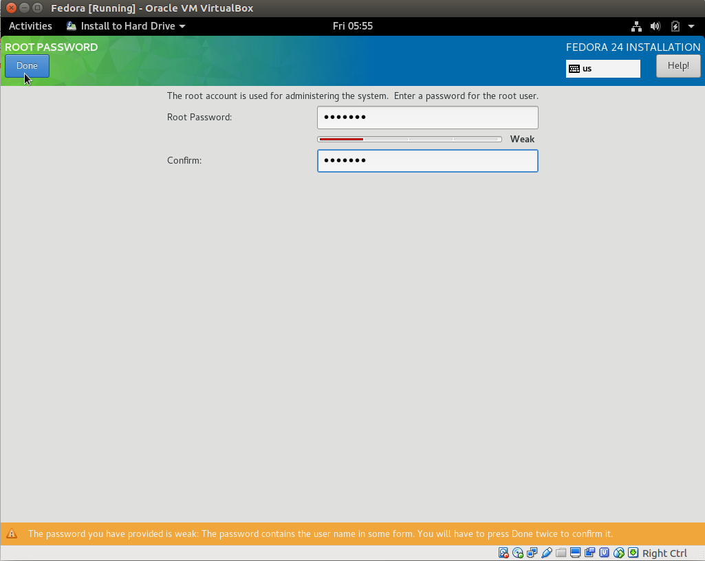

Enter the new user name.

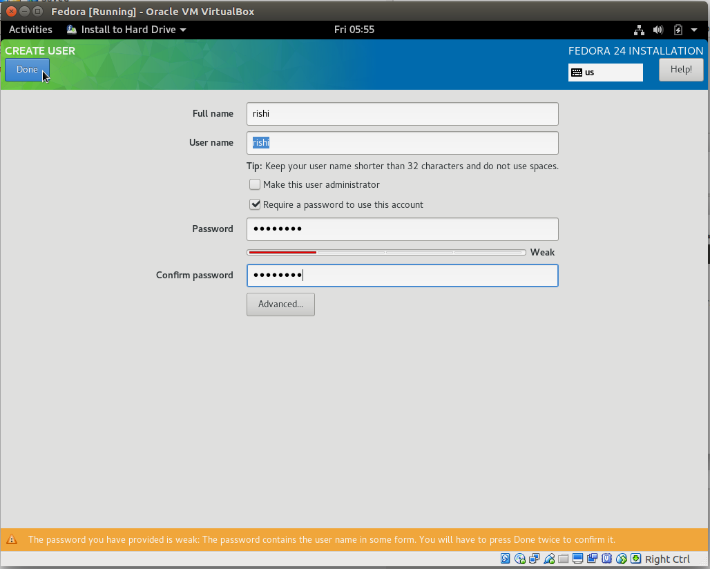

Your installation will start

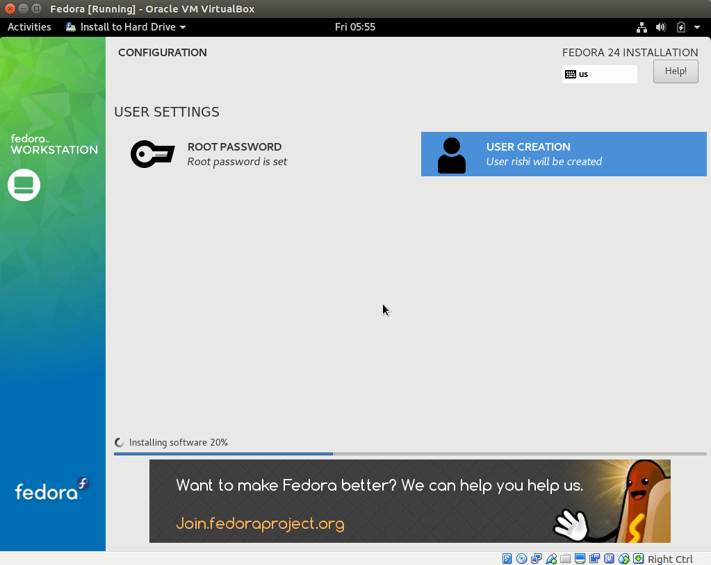

.. raw:: latex

    \clearpage

--------------------------------------------------------------
con_a1220:LinuxInstallation: Installing IDE Geany on Fedora 24
--------------------------------------------------------------

'''''''''''
Description
'''''''''''

Install IDE Geany
---------------------------------

*   Geany is a simple and powerful IDE which will enable you to write code easily.
*   Login into root using the command ``su -``. Give the root's password over here.
*   Run the command for installing ``geany`` - ``dnf install geany``

.. raw:: latex

    \clearpage
